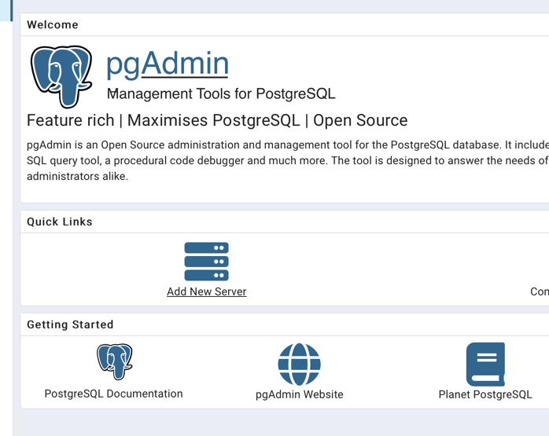
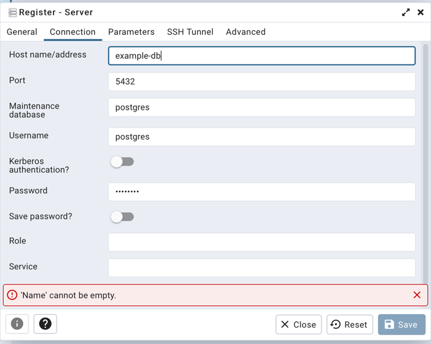

# Prérequis

## En local

Pensez à avoir :
* Avoir `java 15`
* Avoir `maven`
* Avoir `docker desktop`
    * Si docker n'est pas installé, aller voir ce <a href="https://docs.docker.com/desktop/install/windows-install/">tuto</a>
* Avoir `docker-compose`
    * Si docker-compose n'est pas installé, aller voir ce <a href="https://docs.docker.com/compose/install/">tuto</a>

## Base de données via docker

Pour installer la BD postgres, vous n'avez qu'à compiler le docker compose, mettez-vous à la racine du projet et tapez la commande suivante :
```shell
docker-compose -f docker/docker-compose.yml up
```

Cette commande va créer 2 conteneurs, un `postgres` et `pgAdmin`

### PgAdmin

* Il vous permet d'avoir une vision directe sur votre base de données ici : [pgAdmin](http://localhost:5050)
* Identifiant de connexion :
```yml
email : admin@admin.com
password: root
```

Étapes pour connecter votre bd :
1) Ajouter un serveur dans pgAdmin
   
2) Remplir avec les informations suivantes :
   ```yml
   host: localhost
   port: 5432
   username: postgres
   password: postgres
   ```
   en photo :

   

